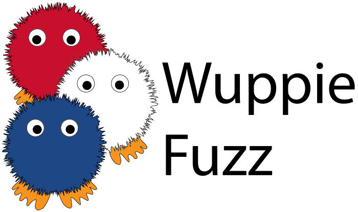

# WuppieFuzz v1.4.0

<picture>
  <source media="(prefers-color-scheme: dark)" srcset="assets/WuppieFuzz-dark.svg">
  <source media="(prefers-color-scheme: light)" srcset="assets/WuppieFuzz.svg">
  
</picture>

TNO developed WuppieFuzz, a coverage-guided REST API fuzzer developed on top of
LibAFL, targeting a wide audience of end-users, with a strong focus on
ease-of-use, explainability of the discovered flaws and modularity. WuppieFuzz
supports all three settings of testing (black box, grey box and white box).

WuppieFuzz was featured in
[the ONE Conference e-magazine 2024](https://emagazine.one-conference.nl/2024/finally-validate-your-publicly-exposed-interfaces-with-ease/).

> [!NOTE]  
> For a quick, follow-along guidance please follow the [tutorial](./tutorial)!

## Quick install

For quick installation of WuppieFuzz for popular operating systems (MacOS,
Windows, Linux) see [releases](https://github.com/TNO-S3/WuppieFuzz/releases/) or use [`brew install wuppiefuzz`](https://formulae.brew.sh/formula/wuppiefuzz)

### Short how-to

[](https://www.youtube.com/watch?v=-oR4d9aXrqo)

## Prerequisites for development

To build the project you need to install the following dependencies and tooling

- build-essential `sudo apt install build-essential`
- pkg-config `sudo apt install pkg-config`
- Rust `curl --proto '=https' --tlsv1.2 -sSf https://sh.rustup.rs | sh`

## Run

<picture>
  
</picture>

Before running WuppieFuzz, you have to start your (instrumented) target
application.

Additionally, you must supply WuppieFuzz with an **OpenAPI-specification** so it
knows how to generate and mutate its requests. For help on the command line
arguments, use the following:

```sh
$ cargo run -- --help # shows help for required parameters and flags

Usage: wuppiefuzz [OPTIONS] [OPENAPI_SPEC.YAML]
...
```

For example, to run WuppieFuzz against a Java target with the JaCoCo agent
attached, you specify its OpenAPI file (containing the URL the target is running
on in the API specification). In addition, you specify that the coverage format
is JaCoCo, and give the classes directory as follows:

```sh
cargo run -- fuzz openapi.yaml --coverage-format jacoco --jacoco-class-dir ../Targets/app/target/classes/
```

## Configuration file

If you want to use a configuration file instead of/in combination with command
line arguments, you can use the flag `--config <CONFIG_FILE>`. In case you use
command line arguments in combination with a configuration file, command line
arguments take precedence.

The configuration file should be a yaml file and contain a line for each command
line argument you want to specify, for example:

```yaml
coverage_format: jacoco
output_format: human-readable
source_dir: "/swagger-petstore/src/main/java"
jacoco_class_dir: "/swagger-petstore/target"
timeout: 20
```

An example run command could in this case be:

```sh
$ cargo run -- fuzz --config=config.yaml --report --coverage-host=localhost:6300 --timeout=10 ./openapi.yaml
```

This line would combine the arguments from the command line and from the config
file. Since the flag `--timeout` is specified in both, the timeout specified in
the command line (10 seconds) will take precedence.

In the directory `example_configs/` you will find two example config files to
use for generating coverage reports with JaCoCo for Java code and for generating
coverage reports with LCOV for Python code.

## Reports

When you WuppieFuzz with the `--report` flag, a subdirectory is made inside
`reports/` with a timestamp as its name. All supported coverage report(s) are
written into this subdirectory. There are two types of coverage reports:

1. **endpoint coverage**: this can always be generated since it only requires
   the OpenAPI-spec.
2. **code coverage**: currently only supported for JaCoCo, but we aim to support
   more. The tricky part is that this requires a mapping from coverage to source
   files, and robust report generation that uses this.

On top of that a database is filled with all request information related to your
fuzzing campaign. This database can be visualised and explored through the
Grafana dashboard.

## Structure of this repository

- **assets**: logos, images, etc.
- **coverage_agents**: code and instructions for coverage tracking to slap onto
  various targets
- **example_configs**: example configuration files to configure WuppieFuzz
- **src**: source code of WuppieFuzz
- **tutorial**: an in-depth and low-level tutorial about how to fuzz a specific
  target and how to interpret fuzzing results
- **dashboard**: tooling to triage the fuzzing results and performance

For more information on each of these, see the READMEs in these directories.

## Generating documentation

`cargo doc --no-deps` to generate documentation from comments in the source
code. The main page of the documentation will be
`target/doc/wuppiefuzz/index.html`
